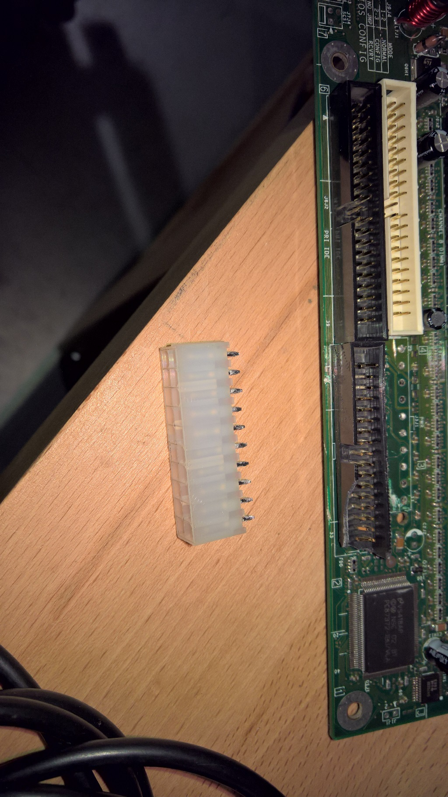
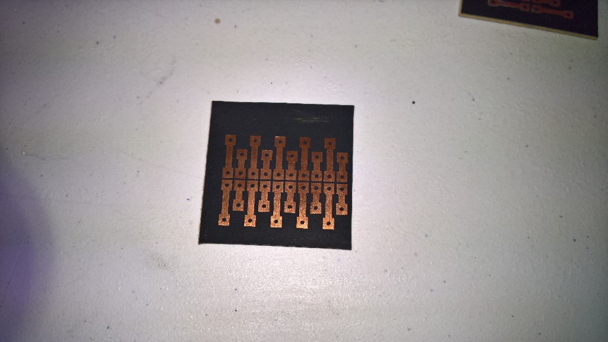
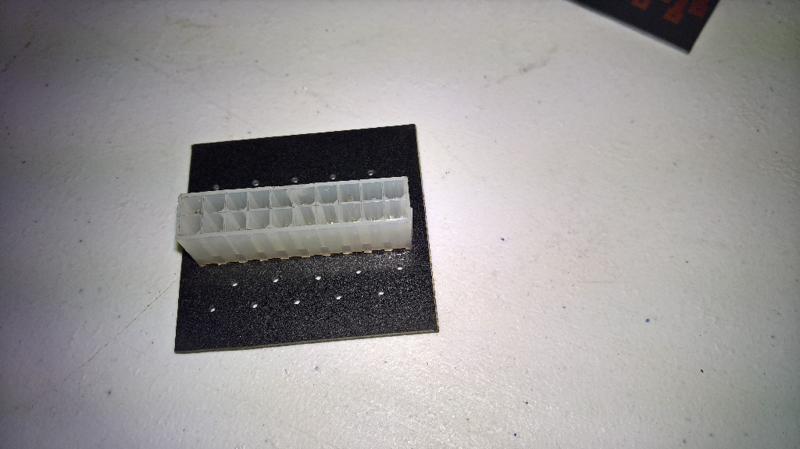
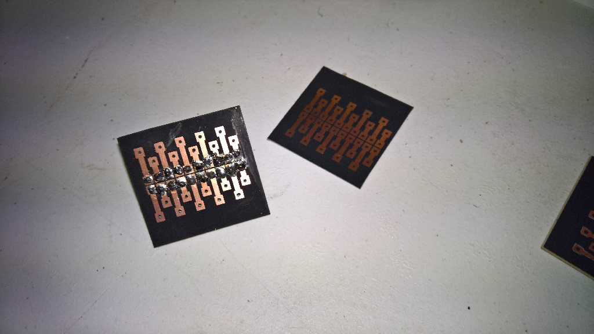
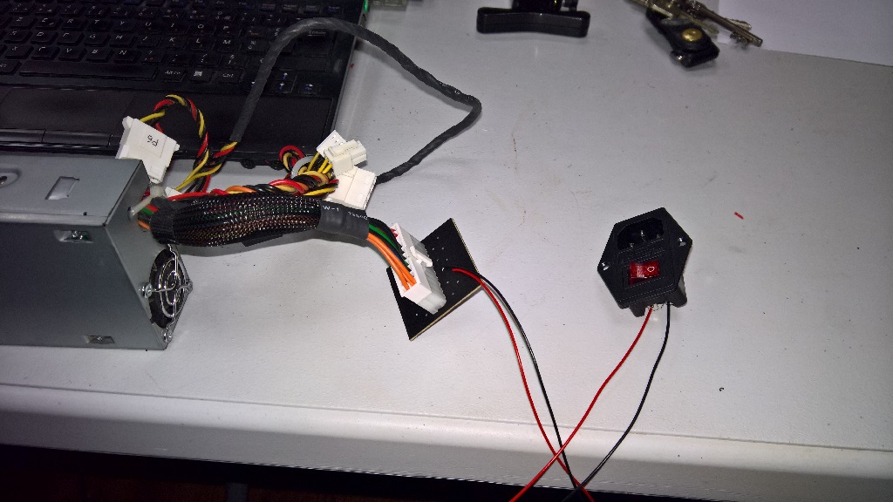

# L'alimentation

Il s'avère que le bloc d'alimentation FSP-180 à une protection qui ne permet pas de la démarrer uniquement avec un pont sur le POWER-ON.

Nous avons donc récupéré une alimentation d'un vieux Shuttle pour le moment.
 

## Récupération d'un prise femelle pour le connecteur de l'alimentation

Déssoudage de la prise femelle d'une vielle carte mère

## Gravage d'une petite plaque pour souder la prise d'alimentation

Soudure de la prise

Soudure de deux cables sur les pin 16 et 17, reliés à un interrupteur. 

