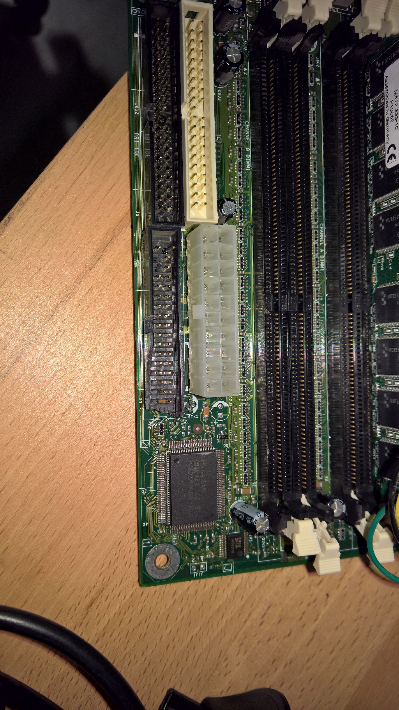

# L'alimentation

Il s'avère que le bloc d'alimentation FSP-180 à une protection qui ne permet pas de la démarrer uniquement avec un pont sur le POWER-ON.

Nous avons donc récupéré une alimentation d'un vieux Shuttle pour le moment.
 

## Récupération d'un prise femelle pour le connecteur de l'alimentation

Déssoudage de la prise femelle d'une vielle carte mère

## Gravage d'une petite plaque pour souder la prise d'alimentation

Soudure de la prise

Soudure de deux cables sur les pin 16 et 17, reliés à un interrupteur. 

## Alimentation de l'Arduino

Récupération d'un cable d'une alimentation secteur, recherche du positif qui est la broche **intérieure** de la prise jack.

Lorsque l'arduino est alimenté par le régulateur, il faut lui transmettre une tension conseillée entre 7V et 12V (les limites sont 6V et 20V). On branche donc le cable sur une sortie 12V de l'alimentation.

Dans notre cas on a utilisé la broche 10 (12V) et la broche 7 pour la masse.

## Alimentation du Raspberry Pi

Les Rapsberry Pi sont alimentés avec du 5V.

Récupération d'un cable USB/micro USB.

On coupe la prise USB, on dénude les fil rouge (+5V) et noir (masse).

On branche nos fils sur les broches 6 (+5V) et 5 (masse).

## Mise en place de l'interrupteur et alimentation

Percage de la coque pour placer un interrupteur avec prise d'alimentation.

